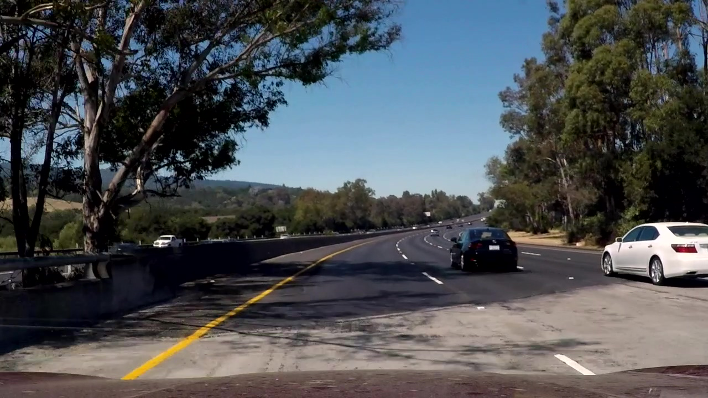
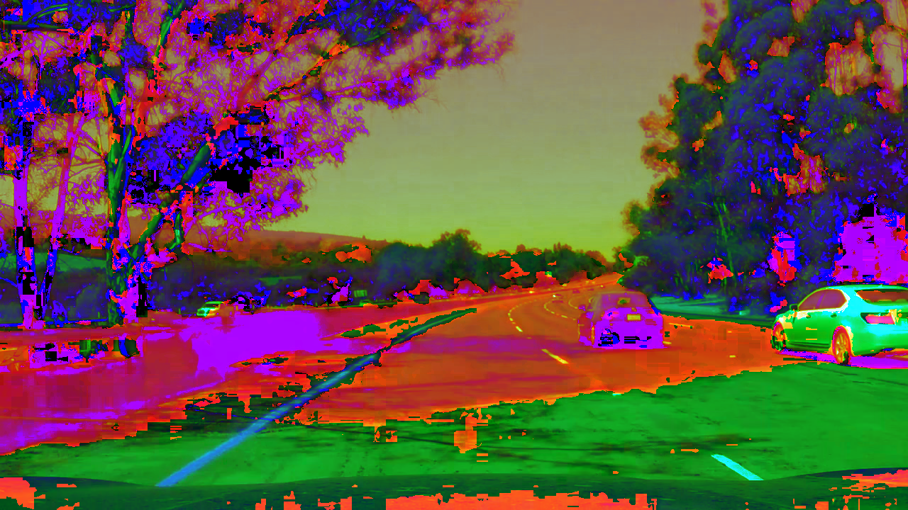
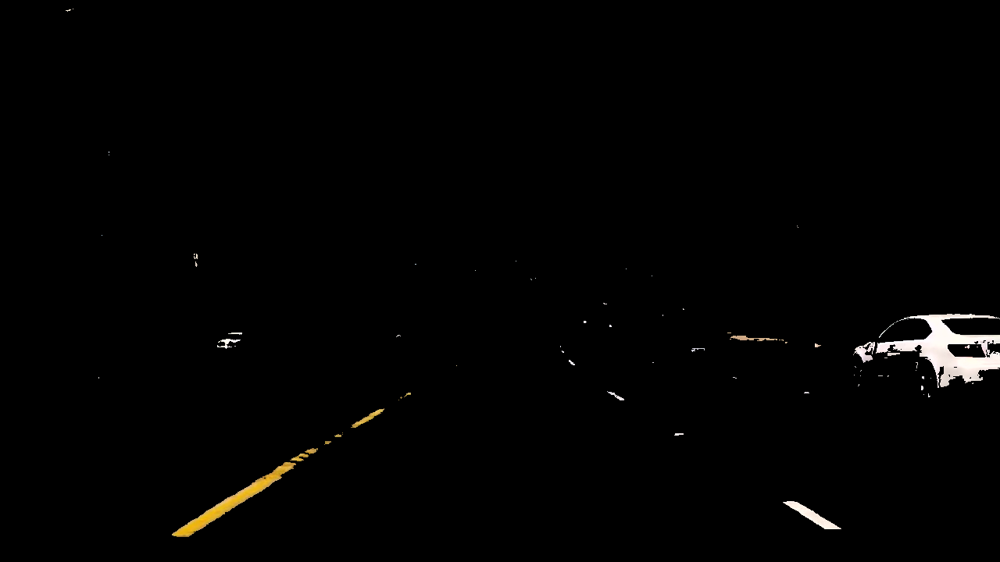
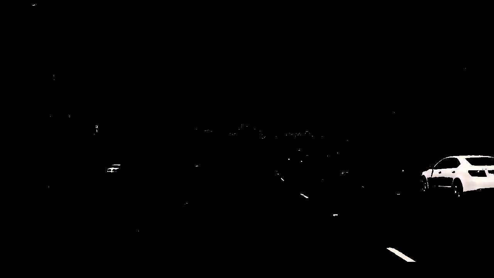
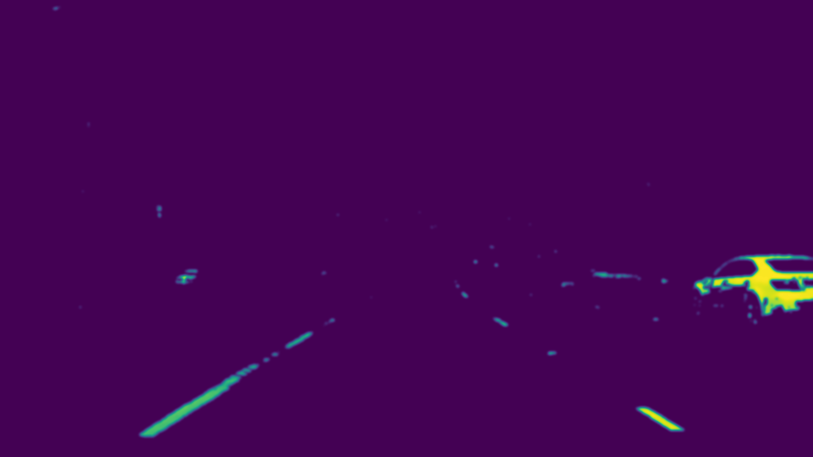
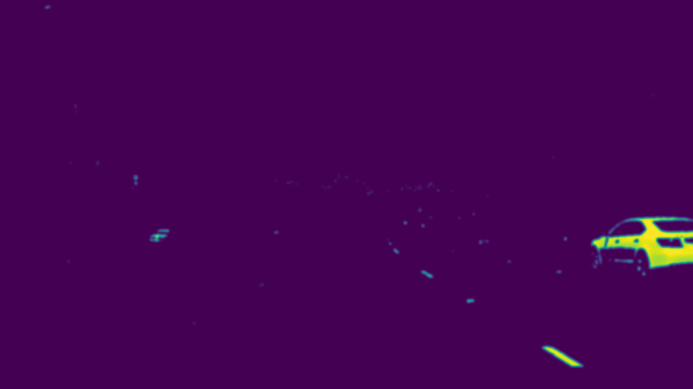
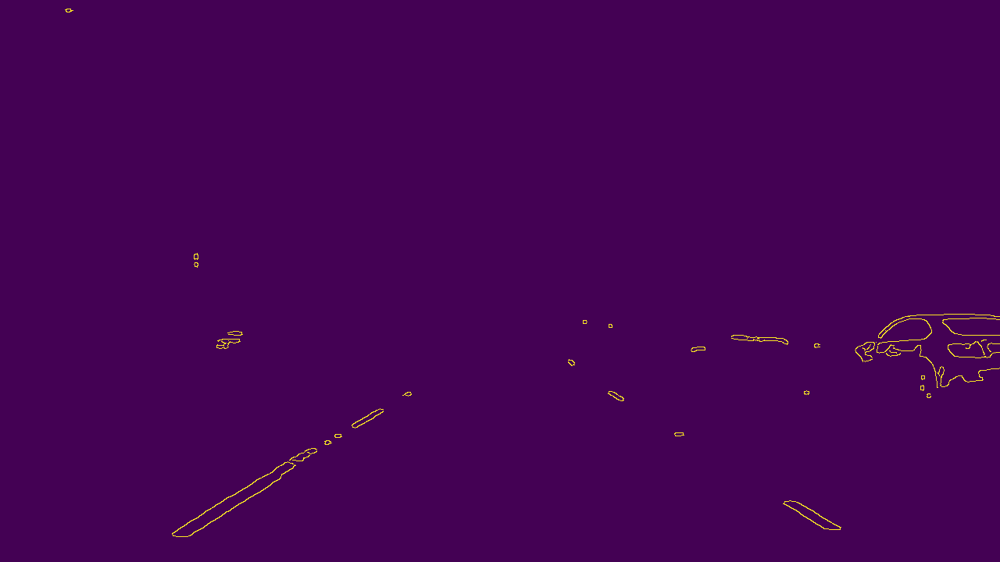
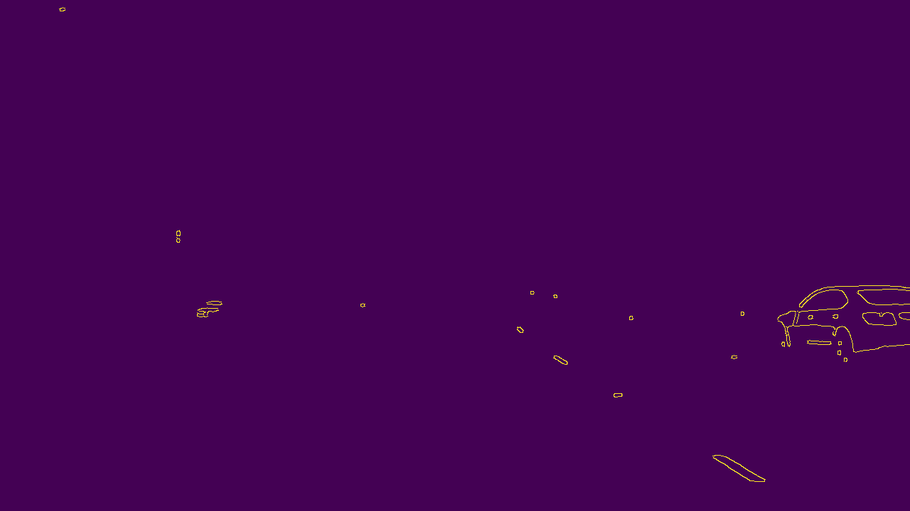
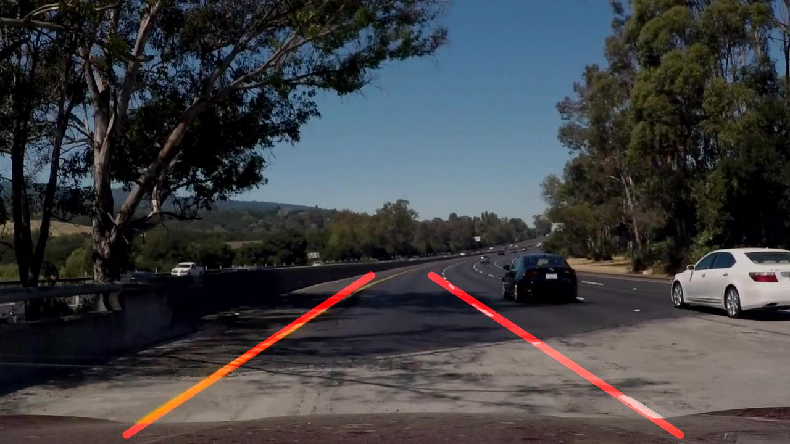
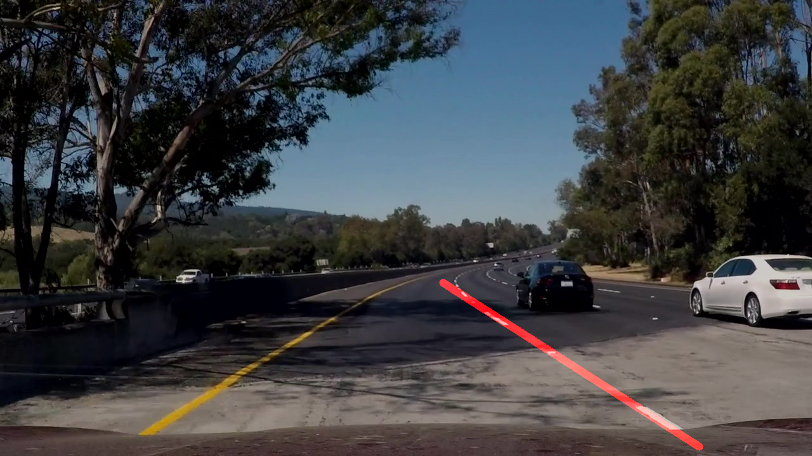

# **Finding Lane Lines on the Road** 

The goals / steps of this project are the following:
* Make a pipeline that finds lane lines on the road
* Reflect on your work in a written report

---
## Image Show

The following pictures is a comparative result on a same complex image in different color space. The left is HLS color space, right is RGB color space. 


* Original Image

    

* HLS VS RGB

    

* Detect white and yellow color

    

* Gaussian Smoothing

    

* Canny Edge Detection

    

* Hough, ROI, and Merge

    

## Reflection

### 1. Describe your pipeline. As part of the description, explain how you modified the draw_lines() function.

[Described below](#42-draw-line).

### 2. Identify potential shortcomings with your current pipeline

- Maybe has some problems on a sharp turn or changing lane.

- Lines still have jitter in the videos.

- The region of interest is too large or two small when the car goes up or down a slope.

- If the road is wet or shine by taillight of car, this SW will be crash.

### 3. Suggest possible improvements to your pipeline

- I saw somebody use standard deviation and RANSAC. Looks better. I'll try them when I master how to program these algorithm.

---

## Procedure

### 1. Color Processing

This step is to make lanes pixels color highlight in full image.

#### 1.1. Color Space Conversion

First, I use grayscale, it works well in the first two videos. But it gets messy on the challenge video, because there is many shadows on the left yellow lane. Then, I try some other color space, HLS looks fine even if in the worst situation.

```python
img_cov = cv2.cvtColor(img, cv2.COLOR_RGB2HLS_FULL)
```

#### 1.2. Pick White and Yellow Color

The Lanes are white and yellow. But there are not white and yellow in the convert color space yet, need to select a different RGB range values. How to select color range values? I use matplotlib.pylot lib show the coverted image and use mouse over the white and yellow lane get a approximate range.

```python
y_upper = np.array([40, 255, 255])
y_lower = np.array([0, 100, 100])
w_upper = np.array([255, 255, 255])
w_lower = np.array([0, 200, 0])
```

After that, merge yellow and white image with original one.

```python
y_img_mask = cv2.inRange(img_cov, y_lower, y_upper)
w_img_mask = cv2.inRange(img_cov, w_lower, w_upper)
wy_img_mask = cv2.bitwise_or(y_img_mask, w_img_mask)
wy_img = cv2.bitwise_and(img, img, mask=wy_img_mask)
```

#### 1.3. Grayscale

Why convert from RGB to Grayscale?[[Ref](https://www.quora.com/In-image-processing-applications-why-do-we-convert-from-RGB-to-Grayscale)]

> - **Vector VS Scalar**: Image processing uses the concept of ‘comparing’ sections in an image. Comparison in Grayscale involves simple scalar algebraic operators (+ , -). But if you want to differentiate colours, the methods are a bit more complex. 

> - **Intensity data is usually sufficient**: For simple tasks (e.g. edge detection), intensity plays a major role. Grayscale (i.e. intensity) is usually sufficient to distinguish such edges.

```python
gray = grayscale(wy_img)
```

### 2. Edges Detection

#### 2.1. Gaussian Smoothing

> Gaussian smoothing, which is essentially a way of suppressing noise and spurious gradients by averaging. cv2.Canny() actually applies Gaussian smoothing internally, but we include it here because you can get a different result by applying further smoothing. [Ref Online Course]

```python
kernel_size = 11
blur_gray = gaussian_blur(gray, kernel_size)
```

#### 2.2. Canny Edge Detection

> **Threshold values**, minVal and maxVal. Any edges with intensity gradient more than maxVal are sure to be edges and those below minVal are sure to be non-edges, so discarded. Those who lie between these two thresholds are classified edges or non-edges based on their connectivity. If they are connected to "sure-edge" pixels, they are considered to be part of edges. Otherwise, they are also discarded. [[Canny Theory](http://docs.opencv.org/trunk/da/d22/tutorial_py_canny.html)]

```python
low_threshold = 50
high_threshold = 3 * low_threshold
edges = canny(blur_gray, low_threshold, high_threshold)
```

### 3. Region of Interest (ROI)

> Assume that the front facing camera that took the image is mounted in a fixed position on the car, such that the lane lines will always appear in the same general region of the image. Next, take advantage of this by adding a criterion to only consider pixels for color selection in the region where we expect to find the lane lines.[Ref Online Course]

#### 3.1. Define Vertices

I used a fixed number define them at first, but the videos have different resolution, [960x540], [1280x720], so I add a scale fator on the width and height of image.

```python
height, width, _ = image.shape
v_bottom_left = [int(width * 0.16), int(height * 0.95)]
v_bottom_right = [int(width * 0.94), int(height * 0.95)]
v_top_left = [int(width * 0.47), int(height * 0.59)]
v_top_right = [int(width * 0.52), int(height * 0.59)]
```

#### 3.2. Draw ROI

```python
vertices = np.array([[v_bottom_left, v_top_left, v_top_right, v_bottom_right]], dtype=np.int32)
masked_edges = region_of_interest(edges, vertices)
```

### 4. Hough Transform

> The classical Hough transform was concerned with the identification of lines in the image, but later the Hough transform has been extended to identifying positions of arbitrary shapes, most commonly circles or ellipses.[[Ref](https://en.wikipedia.org/wiki/Hough_transform)]

Use it to find lines here.

#### 4.1. Hough Parameters [[Ref](http://docs.opencv.org/2.4/modules/imgproc/doc/feature_detection.html?highlight=houghlinesp#houghlinesp)]

```python 
rho = 2 # Distance resolution of the accumulator in pixels.
theta = np.pi/180 # Angle resolution of the accumulator in radians.
threshold = 15 # Accumulator threshold parameter. Only those lines are returned that get enough votes.
min_line_len = 20 # Minimum line length. Line segments shorter than that are rejected. 
max_line_gap = 300 # Maximum allowed gap between points on the same line to link them.
```

#### 4.2. Hough Transform

```python
# masked_edges must be a 8-bit, single-channel binary source image
lines = cv2.HoughLinesP(masked_edges, rho, theta, threshold, np.array([]),\
          minLineLength=min_line_len, maxLineGap=max_line_gap)
```

#### 4.2. Draw Line

It's a key step in this project.

```python
def draw_lines(img, lines, color=[255, 0, 0], thickness=12):

    left_fit = []
    left_length = 0
    right_fit = []
    right_length = 0

    for line in lines:
        for x1, y1, x2, y2 in line:
            [m, b] = np.polyfit([x1, x2], [y1, y2], 1)
            # Only use Y axis length since there are white transverse lines nosie in some frame.
            y_length = abs(y2-y1)
            if m > 0:
                right_fit.append(np.array([m, b])*y_length)
                right_length += y_length
            else:
                left_fit.append(np.array([m, b])*y_length)
                left_length += y_length

    # Average slope and intercept according to the lenght weight, then smooth them by slide window filter
    # if there is not line detected, use the last slope and intercept.
    if right_length != 0 and right_length != 0:
        (r_m, r_b) = np.sum(right_fit, axis=0) / right_length
        (l_m, l_b) = np.sum(left_fit, axis=0) / left_length
    else:
        (r_m, r_b) = (None, None)
        (l_m, l_b) = (None, None)
    (l_m, l_b) = slide_filter(left_d, (l_m, l_b))
    (r_m, r_b) = slide_filter(right_d, (r_m, r_b))


    # Get Max and Min y
    max_y = int(img.shape[0] * 0.98)
    min_y = int(img.shape[0] * 0.62)

    # if cannot get the line 5 times continuously, don't draw line.
    if (l_m, l_b) != (None, None) and line_loss_cnt < 5:
        # Get Left & Right bottom and top vertexs. Formula: y = Ax+B -> x = (y-B)/A
        left_bottom_x = int((max_y - l_b) / l_m)
        left_bottom_y = max_y
        left_top_x = int((min_y - l_b) / l_m)
        left_top_y = min_y
        cv2.line(img, (left_bottom_x, left_bottom_y), (left_top_x, left_top_y), color, thickness)

    if (r_m, r_b) != (None, None)  and line_loss_cnt < 5:
        right_bottom_x = int((max_y - r_b) / r_m)
        right_bottom_y = max_y
        right_top_x = int((min_y - r_b) / r_m)
        right_top_y = min_y
        cv2.line(img, (right_bottom_x, right_bottom_y), (right_top_x, right_top_y), color, thickness)
```

- First, I seperate all lines by slope, get all (x1, y1) (x2, y2) of lines, then use np.ployfit() to get a slope and intercept. Set two values min_y, max_y approximately for calculate lane bottom and top. But it's interfered by some horizontal lines.

- Then, I filter the horizontal lines by a slope range. It still bad.

```python
slope_min = np.tan(np.pi*30/180)
if (abs(slope) < slope_min):
    continue
```

- Third, I try to average slope and intercept every line according to their length. About lenght, use Y axis length as weight since there are white transverse lines noise in some frame. Now, it's better and it successfully filters the interfering lines. But the red lines always jetter.

- Fouth, I add a slide window filter which has 10 size. The result is better than before.

```python
left_d = deque(maxlen=10)
right_d = deque(maxlen=10)
line_loss_cnt = 0

def clean_deque():
    left_d.clear()
    right_d.clear()
    line_loss_cnt = 0

def slide_filter(d, line):
    global line_loss_cnt
    if line is not None:
        d.append(line)
        line_loss_cnt -= 1
    else:
        line_loss_cnt += 1
    if len(d) > 0:
        line = np.mean(d, axis=0, dtype=np.float32)
        return line
    else:
        return None, None
```

- At last, if not find a line in a frame, use the previous line instead.

### 5. Merge

The last step, merge the detected line with initial image.

```python
	line_edge = weighted_img(line_img, img)
```


---


